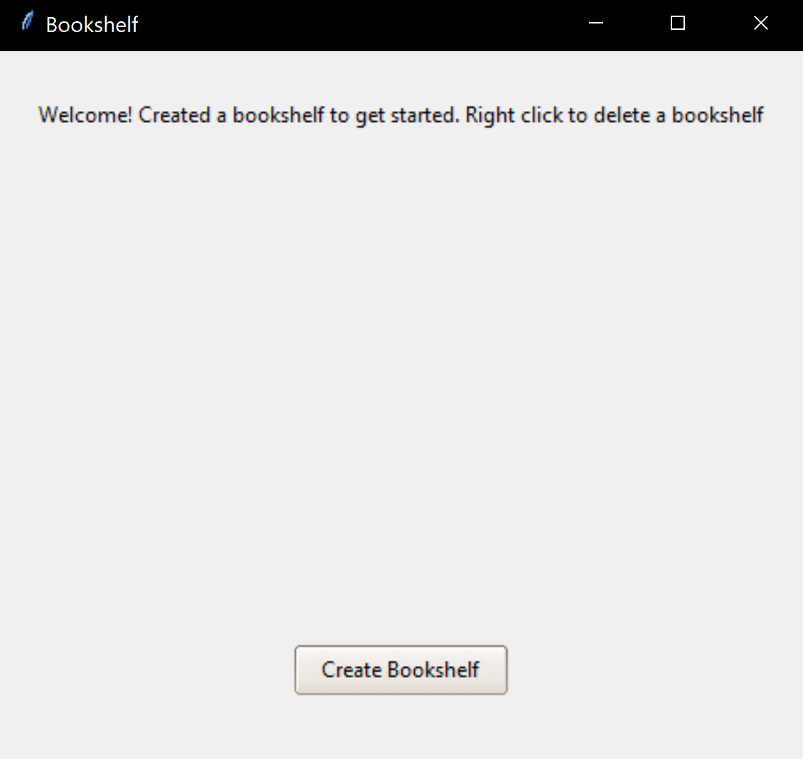
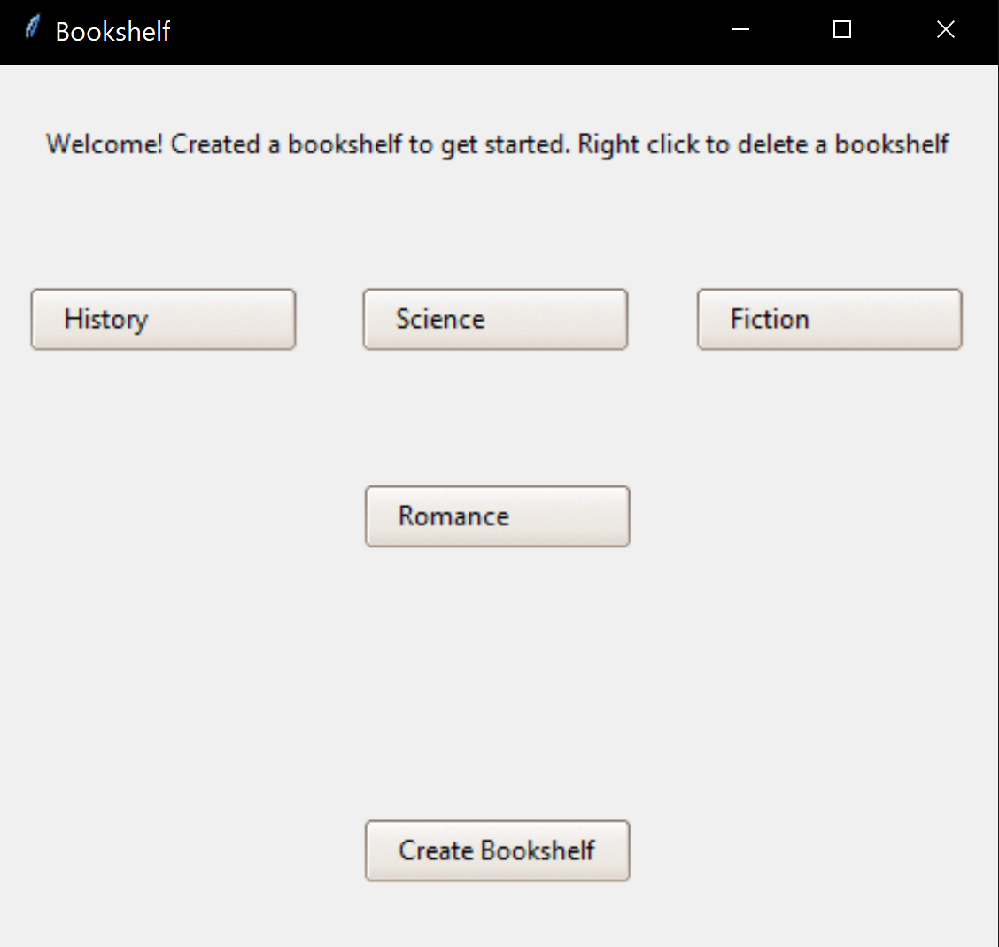
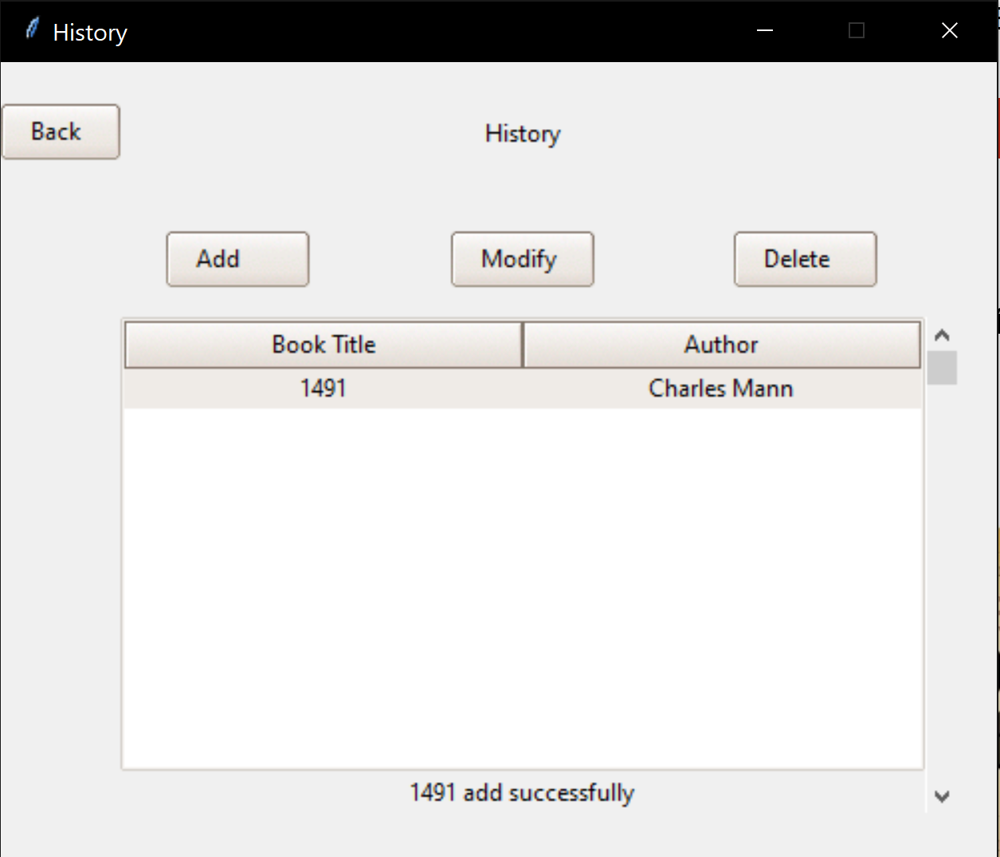

# Tkintershelf

Author: Ehren Lewis

## Table Of Contents

* [About This Project](#about-this-project)
* [How to Install](#how-to-install)
* [Usage](#usage)
* [Known Issues](#known-issues)

* [Questions](#questions)
* [License](#license)
* [Contributing](#contributing)

## About This Project

This application is a GUI application built on Python. This application allows you to have a local storage that emulates a library. You can create up to 9 different shelves, each which can hold books

My motivation behind this project was that I love to read, but I keep my books unorganized. I wanted to create an application that will be avaiable any time that stores my books in any way that I see fit.

I used Python, Tkinter, and Sqlite. Tkinter was used to allow for GUI programming. This also provided the themes used to style the application as well. Sqlite was used so that a database would always be available on load.

Some challenges faced during development included dynamically generating buttons. If not careful, tkinter buttons can have the same location in memory, causing them to reference the same table in the database. To work around this, I had each table name be a node so that they would always have a different location in memory. Then, I would have each node point to the next so that they would always be rendered in order.

 For future iterations, I would like to have it to where the tkinter application can scroll so that the user isn't limited to 9 shelves. I would also like to add more error handling for the user so they can have more creative shelf and book names.
I would also lke to add a seed file so users can enjoy a pre-poulated application.

## How to Install

    1. Navigate to the code repository
    2. Press the green code button, located near the about section
    3. Copy either the HTTPS, Git CLI, download the zip, open with GitHub desktop, or copy the SSH link.
    4. Depending on download method, use Git, executable, or the desktop application to open the content files.
    5. All of the content of the repository will be available after completion of the previous state.
    6. Open the application into your code editor of choice
    7. Navigate into the root directory
    8. Run pip install -r requirements.txt
    9. Run python Bookshelf.py
    

## Usage

To use this package after installation, launch the python file. From there, you will be presented with the GUI landing page. This shows you how to create and delete shelves. Create your first bookshelf by entering a name. Click on the bookshelf after creation and you will be presented with a table. On this second page, you can add books to the bookshelf, and if there are some therem you can modify and delete them as well. Once back to the home page, right clicking on a bookshelf will let you delete one, deleting all the items inside it as well.

## Known Issues

Currently, installing this application can be quite difficult. There is no .exe or containerization, meaning you have to clone the repository, open it with code, then run the python installer text, then run python Bookshelf.py. Other issues include unprotected database querying, so having any characters that trigger sql queries will cause an error to be thrown and the query to be incomplete.

## Questions

You can reach me at my Github: [Ehren-Lewis](https://github.com/Ehren-Lewis)

### OR

You can reach me at my [ehrenlewis0@gmail.com](mailto:ehrenlewis0@gmail.com) pertaining any other questions you may have

## License

MIT License

Copyright (c) 2022 [Ehren Lewis]

Permission is hereby granted, free of charge, to any person obtaining a copy
of this software and associated documentation files (the "Software"), to deal
in the Software without restriction, including without limitation the rights
to use, copy, modify, merge, publish, distribute, sublicense, and/or sell
copies of the Software, and to permit persons to whom the Software is
furnished to do so, subject to the following conditions:

The above copyright notice and this permission notice shall be included in all
copies or substantial portions of the Software.

THE SOFTWARE IS PROVIDED "AS IS", WITHOUT WARRANTY OF ANY KIND, EXPRESS OR
IMPLIED, INCLUDING BUT NOT LIMITED TO THE WARRANTIES OF MERCHANTABILITY,
FITNESS FOR A PARTICULAR PURPOSE AND NONINFRINGEMENT. IN NO EVENT SHALL THE
AUTHORS OR COPYRIGHT HOLDERS BE LIABLE FOR ANY CLAIM, DAMAGES OR OTHER
LIABILITY, WHETHER IN AN ACTION OF CONTRACT, TORT OR OTHERWISE, ARISING FROM,
OUT OF OR IN CONNECTION WITH THE SOFTWARE OR THE USE OR OTHER DEALINGS IN THE
SOFTWARE.

## Contributing

To contribute on this project, contact me through my Github or email.
